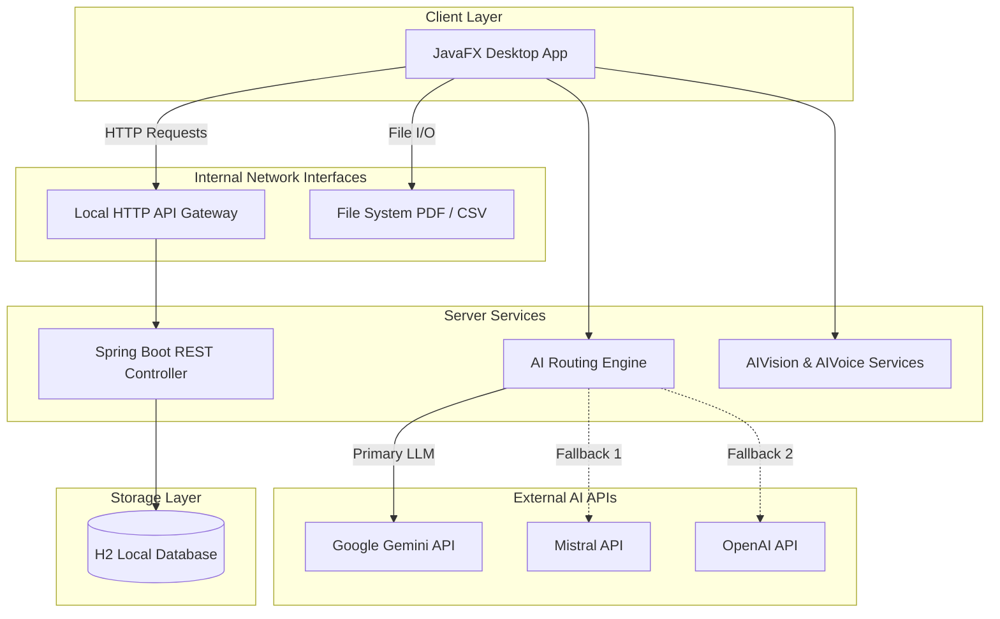

# Finvora - AI-Powered Personal Finance Manager


Finvora is a production-grade, AI-powered personal finance tracker and wealth management workspace. It provides a comprehensive dashboard for monitoring expenses, tracking budgets, and interacting with bleeding-edge AI models for automated financial management.

## Features

### Core Modules
- Expense Tracking: Monitor total expenses, view spending trends, and receive insights.
- Budget Management: Track overall budget utilization and monitor category-specific limits.
- Dashboard Analytics: Visual graphs displaying income versus expenses and total savings.
- Transaction History: Chronological logs of transactions with categories, dates, and precision times.
- Financial Reports: Monthly overviews and performance summaries represented in charts.
- Savings Goals: Tracking progress bars for specific financial targets.

### App Functionalities
- Categorize Spending: Sort expenses into specific customizable categories.
- Budget Alerts: Notification triggers when expenses approach maximum budget limits.
- Category Goals: Establish specific spending limits for different areas of your life.
- Advanced Search & Filters: Sort and find past transactions quickly using specific parameters.
- Data Export: Single-click exporting of financial data into PDF format.
- Visual Goal Tracking: Percentage gauges and progress bars to monitor milestones.

### AI Capabilities
- Multi-LLM AI Fallback Engine: Seamless, resilient chat interactions powered by Gemini, Mistral, and OpenAI APIs.
- Voice-Activated Logging: Inline voice prompting parses spoken commands, grabs the exact time, and logs the transaction.
- AI Receipt Scanner: Upload receipts to automatically extract transaction names, amounts, and dates with zero manual entry.

## System Architecture

The application follows a decoupled client-server architecture, allowing rapid local processing backed by cloud AI inference.



## Tech Stack

### Frontend (Client)
- JavaFX
- Maven
- Apache PDFBox
- JavaFX MediaPlayer

### Backend (Server)
- Spring Boot (Java 17)
- Spring Data JPA 

## Prerequisites

- JDK 17 or higher
- Maven 3.9+

## Environment Setup

**Backend (expense-tracker-springboot-server/src/main/resources/application.properties)**
```properties
server.port=8080
spring.datasource.url=jdbc:h2:file:./data/expense_tracker_db
spring.datasource.driverClassName=org.h2.Driver
spring.datasource.username=sa
spring.datasource.password=password
spring.jpa.database-platform=org.hibernate.dialect.H2Dialect
spring.h2.console.enabled=true
```

**Frontend AI APIs (expense-tracker-client/src/main/java/org/example/services/AIEngine.java)**
Ensure you inject your API keys here before compiling:
```java
private static final String GEMINI_KEY = "YOUR_GEMINI_API_KEY";
private static final String MISTRAL_KEY = "YOUR_MISTRAL_API_KEY";
private static final String OPENAI_KEY = "YOUR_OPENAI_API_KEY";
```

## Quick Run Instructions

Start the backend API server:
```bash
cd expense-tracker-springboot-server
mvn spring-boot:run
```

Start the frontend JavaFX application (in a new terminal):
```bash
cd expense-tracker-client
mvn compile javafx:run
```

## Testing Commands

Run the Maven test suites:

```bash
# Run backend tests
cd expense-tracker-springboot-server
mvn test

# Run frontend tests
cd expense-tracker-client
mvn test
```

## Deployment

Deploy the backend as a standard Spring Boot executable JAR and the frontend as a bundled JavaFX executable. 

```bash
# Build the backend JAR
cd expense-tracker-springboot-server
mvn clean package
java -jar target/expense-tracker-springboot-server-0.0.1-SNAPSHOT.jar
```

## License
This project is licensed under the MIT License.
