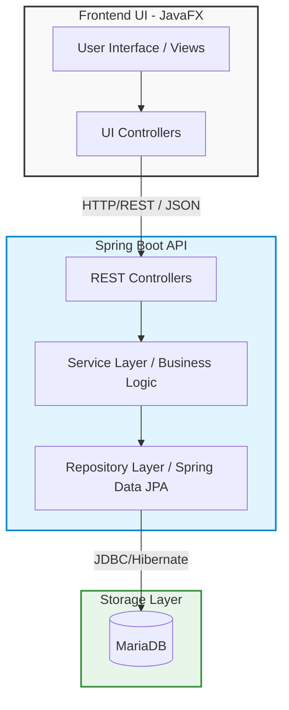

<div align="center">
  

  <h1>Finance Tracker App</h1>
  <p>A comprehensive, full-stack personal finance management desktop application designed to track, analyze, and grow your wealth.</p>
</div>

## 📖 Overview

**Finance Tracker** is a robust desktop application built with a modern Java tech stack to provide users with an intuitive, seamless experience in managing their personal finances. From tracking daily expenses to long-term savings goals, the application centralizes financial data into a dynamic, user-friendly interface.

## ✨ Features

- **Expense Tracking:** Effortlessly add, categorize, and monitor your daily spending.
- **Analytics Dashboard:** Visualize your financial health with smart charts, income vs. expense comparisons, and spending trends.
- **Budget Management:** Set customizable budget limits, receive spending alerts, and track category-specific goals.
- **Transaction History:** Search and filter your transaction history with a detailed timeline view.
- **Financial Reports:** Generate and export monthly financial reports (PDF and CSV formats).
- **Savings Goals:** Create custom savings goals and track milestone achievements over time.

## 🏗️ System Architecture

The application follows a standard multi-layered Client-Server architecture to ensure high scalability and clean separation of concerns.



### Architecture Breakdown:
1. **Frontend (Client):** Developed using **JavaFX**. Handles user interactions, data visualization, and PDF generation. Communicates with the backend using Google Gson for JSON parsing.
2. **Backend (Server):** Built with **Spring Boot**. Manages business logic, request validation, and secure data processing.
3. **Database Layer:** Uses **MariaDB** to persistently store users, transactions, budgets, and goals.

## 🛠️ Tech Stack

**Client-Side:**
- Java 23
- JavaFX 23 (Modern UI components and responsive design)
- Apache PDFBox (PDF Generation)
- Google Gson (JSON Parsing)

**Server-Side:**
- Java 17+
- Spring Boot (Spring Web, Spring Data JPA)
- Maven Build Tool

**Database & Infrastructure:**
- MariaDB
- JDBC Driver

## 🚀 Getting Started

### Prerequisites
- Java Development Kit (JDK) 23 (for Client)
- MariaDB Server

### 1. Database Configuration
Update your database credentials in the backend application properties:
```properties
# expense-tracker-springboot-server/src/main/resources/application.properties
spring.datasource.url=jdbc:mariadb://localhost:3306/expense_tracker_db
spring.datasource.username=your_db_username
spring.datasource.password=your_db_password
spring.datasource.driver-class-name=org.mariadb.jdbc.Driver
spring.jpa.hibernate.ddl-auto=update
```
*Note: Ensure the database `expense_tracker_db` is created in your MariaDB server before running the backend.*

### 2. Running the Backend (Spring Boot)
Navigate to the backend directory and run the Spring Boot application:
```bash
cd expense-tracker-springboot-server
./mvnw clean install
./mvnw spring-boot:run
```

### 3. Running the Frontend (JavaFX Client)
Navigate to the client directory and start the JavaFX application:
```bash
cd expense-tracker-client
mvn clean javafx:run
```

## 🔒 Security & Privacy
This repository utilizes a comprehensive `.gitignore` to ensure that no system-specific configurations, IDE files, environment variables, or sensitive database credentials are inadvertently committed to version control.

## 🤝 Contributing
Contributions, issues, and feature requests are welcome! Feel free to check the [issues page](https://github.com/yuvanvishnupandi/Finance_Tracker_APP/issues).
