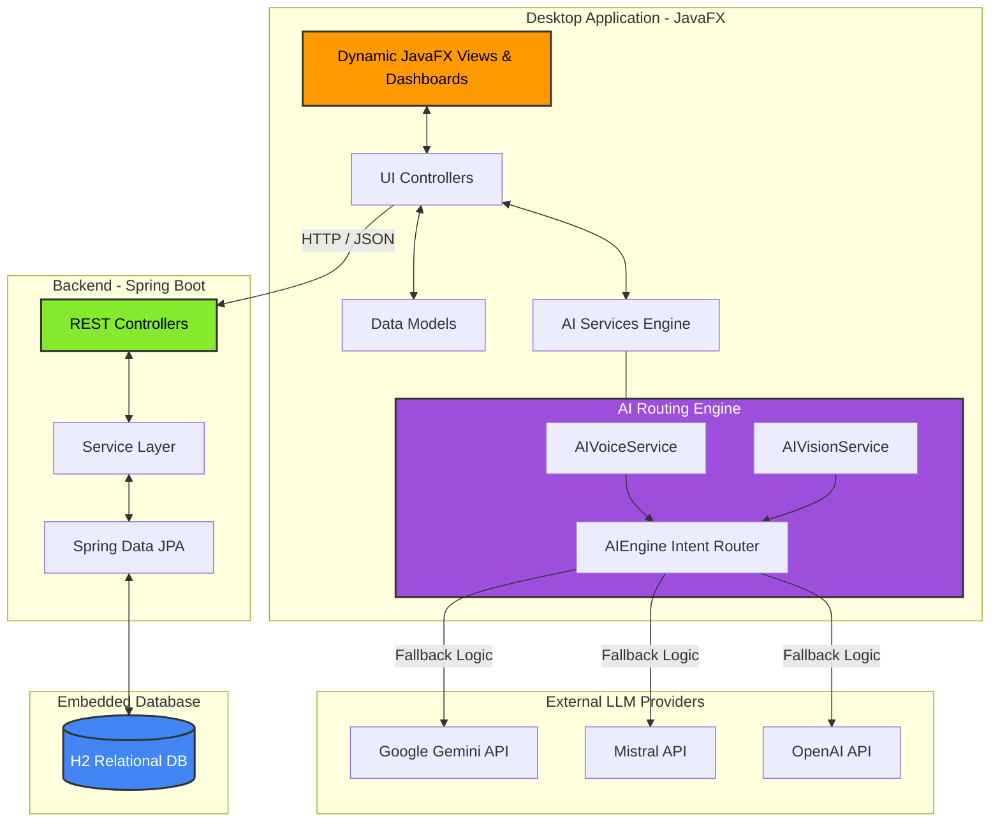

# 💎 Finvora - Next-Gen Personal Finance AI

  

Welcome to **Finvora** (or perhaps *Vaultra, AetherWealth, or NexaFinance*? See name ideas below!). 

Finvora isn't just an expense tracker—it is an **elite, ultra-resilient financial AI assistant** packaged into a stunning desktop application. Built with a modern Java tech stack, it provides users with an intuitive, seamless experience for tracking wealth, setting savings goals, and interacting with bleeding-edge AI models.

---

## ✨ Epic Features

- 🧠 **Multi-LLM Fallback Engine**: Never experience downtime. Chat seamlessly with your AI advisor powered by a resilient engine that routes between **Gemini, Mistral, and OpenAI**.
- 🎙️ **Voice-Activated Logging**: "I spent $50 on food just now." The AI intent router instantly parses your voice, grabs the exact time, and logs the transaction. 
- 📸 **AI Receipt Scanner**: Upload JPEG or PDF receipts and watch the AI extract transaction names, amounts, and dates with zero manual entry.
- 🎨 **Glassmorphic Dual Themes**: Switch between a sleek, vibrant dark mode and a crisp, clean light mode.
- 📊 **Dynamic Budgeting & Goals**: Set up custom savings goals (e.g., "Manali Trip") and monitor progress with real-time visual progress bars.
- 🕒 **Precision Time Tracking**: Advanced TimePicker UI allows you to log exactly when transactions happen, not just the day.

---

## 🏗️ System Architecture 

Finvora utilizes a distinct **Client-Server Architecture** that separates the presentation layer (JavaFX) from the business logic and persistence layer (Spring Boot).



---

## 🛠 Tech Stack Details

### The Frontend (Client)
- **JavaFX**: High-performance UI rendering, programmatic layouts (no FXML), and CSS styling.
- **Maven**: Build automation and dependency management.
- **Gson**: Lightweight, blazing-fast JSON parsing and serialization.
- **Apache PDFBox**: Beautiful PDF report generation.
- **JavaFX MediaPlayer**: Audio playback for AI text-to-speech.

### The Backend (Server)
- **Spring Boot (Java 17)**: Rapid REST API framework.
- **Spring Data JPA & Hibernate**: ORM and database interactions.
- **H2 Database**: Embedded, file-based relational database for rapid, lightweight persistence.

---

## 🚀 Getting Started

### Prerequisites
- JDK 17 or higher
- Maven 3.9+

### 1. Boot up the Backend Server
```powershell
cd expense-tracker-springboot-server
mvn spring-boot:run
```
*(The server will start on http://localhost:8080)*

### 2. Launch the Desktop Client
Open a new terminal window:
```powershell
cd expense-tracker-client
mvn compile javafx:run
```
*(Register a new user and enjoy!)*

---

## 📄 License
This project is licensed under the MIT License.
