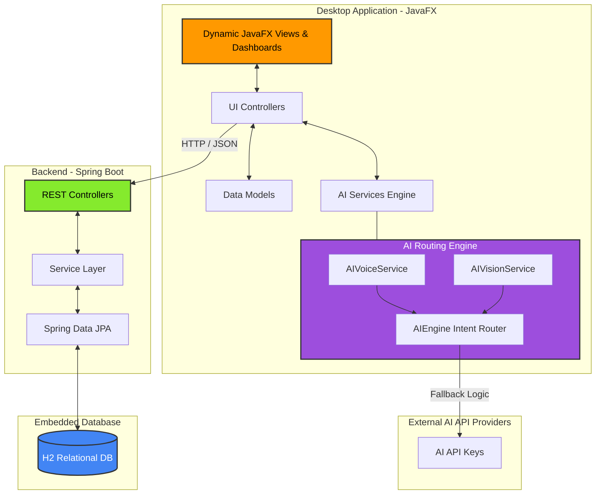

# 💎 Finvora - Finance Tracker

  

Welcome to **Finvora**, an elite personal finance desktop application. Built with a modern Java tech stack, it provides an intuitive, seamless experience for tracking wealth, setting savings goals, and interacting with bleeding-edge AI models.

---

## ✨ Features

- **Multi-LLM AI Fallback Engine**
- **Voice-Activated AI Logging**
- **AI Receipt Scanner**
- **Dynamic Budgeting & Savings Goals**
- **Precision Time & Date Tracking**
- **PDF Report Generation**

---

## 🏗️ System Architecture 

Finvora utilizes a distinct **Client-Server Architecture** that separates the presentation layer (JavaFX) from the business logic and persistence layer (Spring Boot).



---

## 🛠 Tech Stack

### Frontend (Client)
- **JavaFX**
- **Maven**
- **Gson**
- **Apache PDFBox**
- **JavaFX MediaPlayer**

### Backend (Server)
- **Spring Boot (Java 17)**
- **Spring Data JPA & Hibernate**
- **H2 Database**

---

## 🚀 Getting Started

### Prerequisites
- JDK 17 or higher
- Maven 3.9+

### 1. Boot up the Backend Server
Open a terminal window and run the background server logic:
```powershell
cd expense-tracker-springboot-server
mvn spring-boot:run
```

### 2. Launch the Desktop Application
Open a new terminal window and launch the user interface:
```powershell
cd expense-tracker-client
mvn compile javafx:run
```

---

## 📄 License
This project is licensed under the MIT License.
