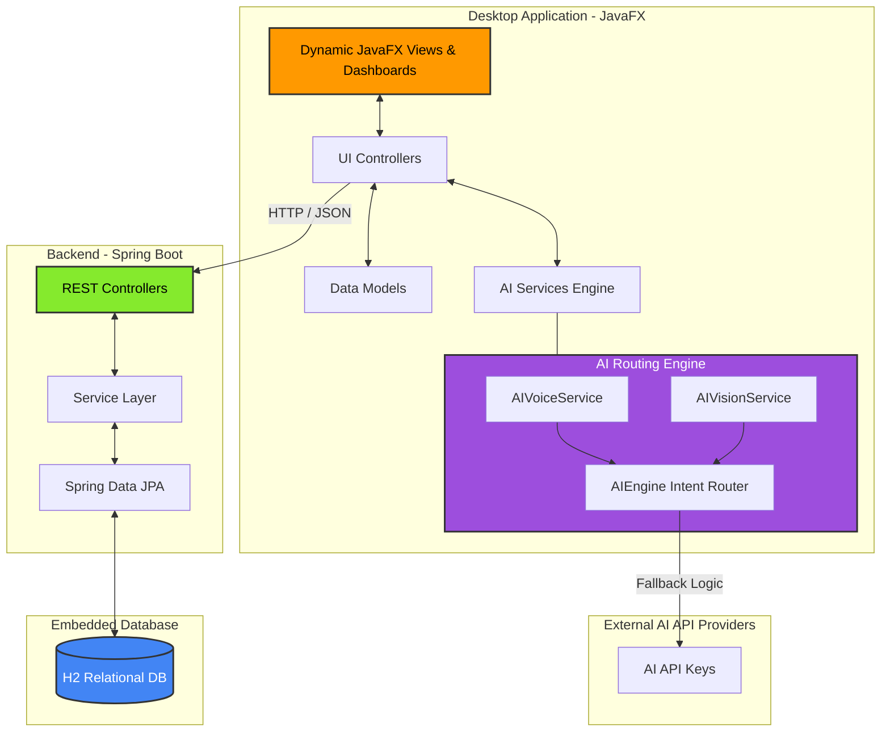

# System Architecture & Diagrams

Finvora utilizes a distinct **Client-Server Architecture** that separates the presentation layer (JavaFX) from the business logic and persistence layer (Spring Boot).

## High-Level Architecture Diagram

## Component Breakdown

### 1. JavaFX Client
- **Views**: Programmatic UI components rendering glassmorphic interfaces and responsive layouts. No FXML is used to guarantee runtime speed.
- **Controllers**: MVC bindings that manage interactions and delegate complex processing (like PDF generation or AI requests) to services.
- **AI Engine**: A highly available multi-provider API router that intelligently handles AI intent resolution and audio processing.

### 2. Spring Boot Server
- **REST Layer**: Secure, standard JSON-based HTTP API built with Spring Web.
- **Data Layer**: Hibernate ORM wrapping standard entity lifecycle management for Transactions, Budgets, and Goals.
- **H2 DB**: File-based zero-configuration database ensuring quick startup and isolation on the user's local machine.
